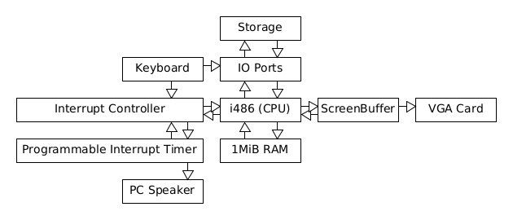

# Building An Operating System for x64-based Computers Using Rust-lang
----
## Planning
- [1] - Introduction
- [1-1] - History Of Operating Systems

- [2] - High-level Overview of Target Hardware
- [3] - Interacting With VGA Hardware

## Introduction

### History Of Operating Systems

One of the first operating systems (OS) is EDSAC's "Initial Orders" built by David Wheeler, it was capable of simple assembly and code re-location, it is 42 18-bit words in size. 

The first professionally built OS was GM-NAA I/O for the IBM 704, built by General Motor's Research Division.

The first Multi-user OS was UNIX built by AT&T. it was designed for the PDP-11.

Later on, Linus Torvalds created Linux, a multi-user Kernel, and licensed it under GPL2. 75% of computers run a Linux-variant.

## High Level View Of the Target Hardware

